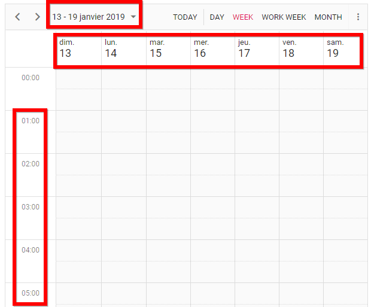
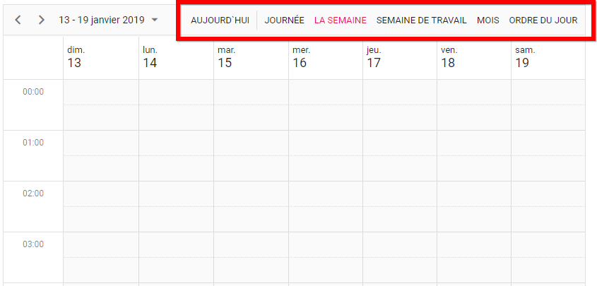

# Angular Scheduler - Globalization and Localization
A quick start Angular project that helps you to create an Angular Scheduler that works globally to meet the diverse needs of users from different cultures and regions. You will also learn how to localize the static text on the Angular Scheduler UI.

## Project pre-requisites
Make sure that you have the compatible versions of TypeScript and Angular in your machine before starting to work on this project.
* Angular 4+
* TypeScript 2.6+

## How to run this application?
To run this application, you need to first clone the `angular-scheduler-globalization-and-localization` repository and then navigate to its appropriate path where it has been located in your system.

To do so, open the command prompt and run the below commands one after the other.

```
git clone https://github.com/SyncfusionSamples/angular-scheduler-globalization-and-localization grid-example
cd grid-example
```

## Installing
Once done with downloading, next you need to install the necessary packages required to run this application locally. The `npm install` command will install all the needed angular packages into your current project and to do so, run the below command.

```
npm install
```

## Globalization and Localization
Although the above `npm install` command will pre-configure the project with all the necessary settings to work with globalization and localization concept, please find the actual steps followed to globalize the Scheduler.

### Globalization
1. To globalize the date and time formats in Scheduler, install the `cldr-data` package using the command,

```
npm install cldr-data --save
```

2. Once the installation is done, import `loadCldr` function from `@syncfusion/ej2-base` package within the `app.component.ts` file.

```
import { loadCldr } from '@syncfusion/ej2-base';
```

Next, you need to load the related cldr data files of the required cultures within the app.component.ts file using the `loadCldr` function, to use the cultures other than `en-US`. In the below code example, I've included the cldr data files of `fr-CH` culture.

```
declare var require: any;

loadCldr(
    require('cldr-data/supplemental/numberingSystems.json'),
    require('cldr-data/main/fr-CH/ca-gregorian.json'),
    require('cldr-data/main/fr-CH/numbers.json'),
    require('cldr-data/main/fr-CH/timeZoneNames.json'));
```

3. Now, you can set the `locale` property to Scheduler and assign the required culture code(`fr-CH) to it.

```
  <ejs-schedule 
  [eventSettings]="eventObject"
  locale='fr-CH' 
  [selectedDate]="setDate">
  </ejs-schedule>
```

4. You can notice the Scheduler displaying globalized date and time values in its UI, as shown in the following image, but the static text like Day, Week, Work Week and so on, are not changed as per the locale assigned to Scheduler.


### Localization

5. To change these static text on Scheduler, provide the appropriate locale word collection to the Scheduler. As a first step, import the `L10n` class from `@syncfusion/ej2-base` package within the app.component.ts file.

```
import { L10n } from '@syncfusion/ej2-base';
```

6. Next, using the `load` function of L10n class, pass the appropriate locale words of `fr-CH` culture as follows,

> NOTE: You can also pass the locale words of other cultures separated by a comma list.

```
L10n.load({
    'fr-CH': {
        'schedule': {
            'day': 'journée',
            'week': 'La semaine',
            'workWeek': 'Semaine de travail',
            'month': 'Mois',
            'today': 'Aujourd`hui',
            'agenda': 'Ordre du jour'
        }
    },
    'ar': {
       'schedule': {
           ...
           ...
       }
    }
});
```

7. Now, you can notice the Scheduler displaying localized text as shown below. 
 

8. You can refer the available locale keys from the following documentation link:
https://ej2.syncfusion.com/angular/documentation/schedule/localization/?#localizing-the-static-scheduler-text

## Running on development server
Run `ng serve` command for a dev server. Navigate to `http://localhost:4200/`. The app will automatically reload if you change any of the source files.

## Further help

To get more help on the Angular CLI use `ng help` or go check out the [Angular CLI README](https://github.com/angular/angular-cli/blob/master/README.md).

